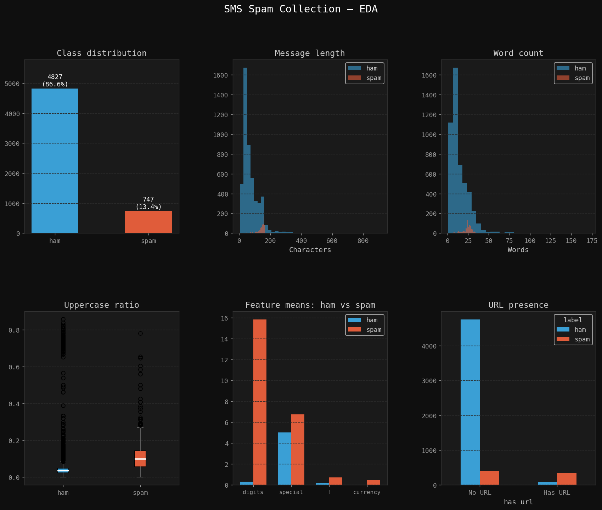
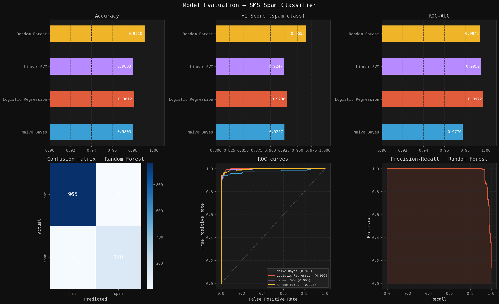

# sms-spam-classifier
NLP pipeline to classify SMS messages as spam or ham
# SMS Spam Classifier

An end-to-end NLP pipeline to classify SMS messages as spam or ham using machine learning.

## Results

| Model | Accuracy | F1 | ROC-AUC |
|---|---|---|---|
| Random Forest | 98.39% | 0.939 | 0.993 |
| Linear SVM | 98.21% | 0.932 | 0.996 |
| Logistic Regression | 98.03% | 0.927 | 0.996 |
| Naive Bayes | 98.12% | 0.929 | 0.977 |

## Pipeline

1. **Data Loading** — 5,574 SMS messages, 13% spam, 87% ham
2. **Feature Engineering** — message length, uppercase ratio, URL detection, currency symbols, exclamation count
3. **Text Cleaning** — lowercase, remove punctuation, stopword removal, Porter stemming (NLTK)
4. **Vectorization** — TF-IDF with bigrams (5000 features) + 8 hand-crafted features
5. **Model Training** — 4 models compared with 5-fold cross-validation
6. **Evaluation** — F1, ROC-AUC, confusion matrix, precision-recall curve

## EDA


## Model Evaluation


## Tech Stack
- Python, scikit-learn, NLTK, pandas, NumPy
- matplotlib, seaborn

## Dataset
[SMS Spam Collection — UCI ML Repository](https://archive.ics.uci.edu/ml/datasets/SMS+Spam+Collection)

## How to Run
```bash
pip install -r requirements.txt
python spam_classifier.py
```

## Top Spam Indicators (TF-IDF)
Words with highest spam signal: `claim`, `prize`, `guarantee`, `ringtone`, `pobox`
